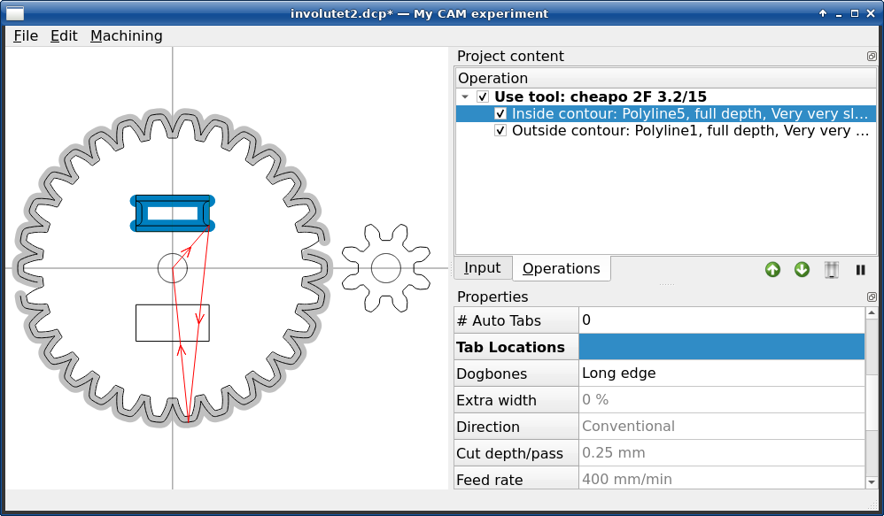

# DerpCAM

DerpCAM is a GUI application for creating 2.5D toolpaths for hobby 3-axis CNC
subtractive machines like routers and mills that are based on LinuxCNC or Grbl.
It is written in Python 3. The GUI is based on Qt5. It has been tested on Linux,
but may potentially run in other Unix based systems as well.

The overall goal was to create a simple but useful open-source (GPL), user-friendly,
well-performing application that could be used by private users and hackerspaces
without worrying about things like licensing, copy protection, Internet access
or capricious vendors removing features.

## Features

The following features are available in the current version:

* import of DXF files from LibreCAD (other DXF files may or may not work,
  some objects like points, splines, ellipses, dimensions and multiline text
  are not supported)

* outside/inside slot milling with optional tabs, wide slots and trochoidal paths

* pocket milling with island support, multiple strategies available (including a HSM strategy via an external library by Duncan Law)

* basic engraving and drilling

* helical milling of round holes of arbitrary diameter

* tabs placement either automatic or manual

* optional dogbones (corner overcut) for slot-and-tab designs, with 3 automatically-calculated variants to choose from

* ramped/helical entry support for milling hard materials

* project file support with per-project tools/presets

* global tool/preset library

* undo/redo

* G-Code output using Grbl or LinuxCNC dialects

### Incomplete/work-in-progress features

The following features may have unexpected limitations or bugs, but also might work
just fine in many cases.

* external milling - producing a target shape by milling from the outside edges

* rest machining - refining a coarsely-milled pocket using a finer tool

* single-line text objects - no need to convert text to paths for most operations, it is based on system fonts like TrueType/OpenType etc.

* inch support - import/export and some of the data entry supports inch values, but values are displayed in metric only

* automated testing facilities are limited and need a lot more work

## Requirements and installation

The following third-party Python 3 packages are required:

* PyClipper
* PyVoronoi
* Shapely

Those can be installed using the following command:

        pip3 install pyclipper pyvoronoi shapely

The current method of installing DerpCAM is to download it from github:

        git clone https://github.com/kfoltman/DerpCAM/
        cd DerpCAM

Additionally, it is highly recommended to obtain the HSM library by running the
following command from the DerpCAM directory:

        ./get-hsm.sh

To launch the application, use the following command from the DerpCAM directory:

        ./DerpCAM

No installation is needed, the application can run from the directory it has
been downloaded to.

## License

DerpCAM is licensed under a GNU General Public License version 3.

## Disclaimer

This project is not meant for use in a professional environment, as it lacks many
features or stability of its commercial and shareware counterparts. It does not
support G-Code dialects used by the common commercial machine vendors. It does
have bugs. Corners have been cut in many places. Use at your own risk. There
is no warranty of any kind.
